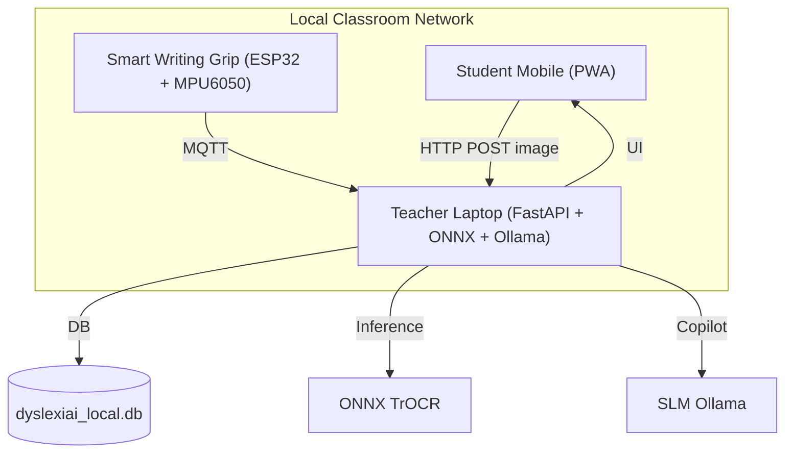

## **Ide/Solusi Pemecahan Masalah**

### **1. Judul Projek/Ide**

DyLeks — Ekosistem Edge‑AI Offline + PWA Multi‑Device dengan Smart Writing Grip untuk Skrining Dini dan Intervensi Multisensorik Anak Disleksia di Daerah 3T

### **2. Tema/Bidang yang dipilih**

Education

### **3. Latar Belakang**

- **Konteks Masalah:** Di daerah 3T (Tertinggal, Terdepan, Terluar) Indonesia diperkirakan terdapat ~5 juta anak disleksia, >80% tidak terdeteksi dini. Sumber daya psikologi dan akses internet jarang tersedia.
- **Riset Pengguna:** Wawancara guru & orang tua (contoh: Ibu Rahma, Pak Joko) menunjukkan minim instrumen diagnosis, biaya & jarak ke ahli tinggi, serta trauma psikologis pada anak.
- **Pernyataan Masalah Inti (How Might We...):** How might we menyediakan alat skrining dan intervensi inklusif yang 100% offline, mudah digunakan oleh guru awam, dan berjalan pada laptop/inventaris sekolah rendah spesifikasi?

### **4. Target Pengguna**

- Primary: Anak SD (usia 6–12) di wilayah 3T yang terindikasi disleksia/disgrafia.
- Secondary: Guru SD di pelosok, orang tua murid, Dinas Pendidikan daerah.

### **5. Deskripsi Ide**

**Konsep Solusi:** DyLeks menggabungkan PWA luring (Next.js) sebagai klien, FastAPI lokal sebagai server, model TrOCR terkompresi ke ONNX untuk OCR tulisan tangan, dan Smart Writing Grip (ESP32 + MPU6050) untuk telemetri kinematik menulis.

**Rancangan Awal / User Flow:**
1. Guru menyiapkan hotspot lokal; laptop bertindak sebagai server.
2. Siswa menulis di kertas dengan Smart Grip; sensor IMU merekam trajektori dan mengirim via MQTT.
3. Guru/Orang tua memotret tulisan; PWA mengirim gambar ke server.
4. Server menjalankan ONNX TrOCR + analisis pola reversal; menyimpan hasil ke `dyslexiai_local.db`.
5. Aplikasi menampilkan risk score, rekomendasi latihan OG, dan modul gamified untuk siswa.

### **6. Tujuan**

- Menyediakan alat skrining luring yang valid dan dapat dijalankan pada laptop sekolah inventaris.
- Meningkatkan deteksi awal hingga minimal 85% akurasi klasifikasi pola reversal pada uji lapangan.
- Menyebarkan modul training & Train‑the‑Trainer untuk 10 SD di area 3T dalam 6 bulan uji coba awal.

### **7. Inovasi**

- Kombinasi citra kertas (OCR) dan telemetri kinematik dari Smart Grip memberikan diagnosis siber‑fisik unik.
- Sistem 100% offline (Local Mesh + ONNX + Ollama SLM) mengatasi batasan infrastruktur 3T.
- Integrasi Orton‑Gillingham cumulative review dengan gamification untuk retensi jangka panjang.

### **8. Dampak Ide/Proyek**

- Mengurangi anak tak terdiagnosis di area 3T, sehingga intervensi bisa segera diberikan.
- Meningkatkan akses pendidikan inklusif dan mengurangi stigma negatif terhadap anak berkebutuhan khusus.
- Potensi skala ke program BOS atau pendanaan CSR untuk keberlanjutan distribusi hardware & pelatihan.

### **9. Aspek STEM**

- Science: Pengukuran kinematik tangan (accelerometer & gyroscope) untuk analisis perilaku menulis.
- Technology: Edge‑AI (TrOCR→ONNX), MQTT, FastAPI, PWA Next.js.
- Engineering: Desain hardware Smart Grip & casing 3D; kalibrasi sensor.
- Mathematics: Analisis statistik risk score, error pattern recognition, dan metrik evaluasi model.

### **10. Kontribusi AI**

- OCR berbasis TrOCR dikompresi ke ONNX untuk inferensi lokal.
- RapidFuzz untuk fuzzy matching kata lokal.
- Ollama SLM lokal sebagai Teacher's Offline Copilot untuk rekomendasi pedagogis.
- Model hybrid (visual + kinematic features) untuk klasifikasi reversal & dysgraphia.

### **11. Sustainability**

- Operasional gratis untuk sekolah 3T (zero‑operational cost bagi pengguna) dengan pendanaan awal dari hibah kompetisi (Samsung SFT) dan CSR.
- Model distribusi: paket offline installer via USB + workshop Train‑the‑Trainer untuk guru lokal.
- Komunitas open‑source untuk desain Smart Grip dan model, memungkinkan perbaikan lokal dan pemeliharaan berkelanjutan.

---

**Lampiran singkat:** fitur utama (Screening, Listen Card, OG Cumulative Review, Smart Grip IoT, Gamification, Local Mesh Dashboard) dan struktur kode tersedia di `README.md`.
 
---

## Proposal Terperinci — DyLeks

Ringkasan eksekutif

DyLeks adalah solusi pendidikan inklusif yang dirancang untuk mendeteksi dini dan memberikan intervensi multisensorik bagi anak disleksia di daerah 3T (Tertinggal, Terdepan, Terluar). Sistem bekerja 100% offline menggunakan kombinasi Progressive Web App (PWA), FastAPI server lokal, model OCR terkompresi (TrOCR → ONNX), dan perangkat IoT sederhana (Smart Writing Grip berbasis ESP32 + MPU6050). Proposal ini merinci tujuan, metodologi, arsitektur teknis, rencana implementasi, metrik keberhasilan, estimasi biaya ringkas, serta risiko dan mitigasinya.

1. Masalah terukur dan tujuan proyek

- Masalah: Kurangnya deteksi dini disleksia pada anak SD di area 3T; estimasi >80% anak disleksia tidak terdeteksi.
- Dampak: Anak mendapat labeling negatif, putus sekolah, dan rendahnya kesempatan akademik jangka panjang.
- Tujuan utama: Menyediakan alat skrining dan intervensi yang dapat dipakai oleh guru tanpa pelatihan psikologi khusus, berjalan pada laptop inventaris sekolah, dan dapat diluncurkan sebagai pilot di 10 SD area 3T dalam 6 bulan.

2. Metodologi dan pendekatan

- Pendekatan hybrid siber‑fisik: menggabungkan analisis citra tulisan tangan (OCR) dan telemetri kinematik saat menulis. Ini memungkinkan identifikasi pola reversal, omission, hesitation, dan tremor yang relevan untuk diagnosis awal.
- Proses: rekrut 10 sekolah pilot → pelatihan guru (Train‑the‑Trainer) → pengumpulan data baseline (n≈500 anak) → iterasi model & kurikulum OG → uji lapangan evaluasi kuantitatif & kualitatif.

3. Ruang lingkup fungsional (apa yang akan dibangun)

- Frontend PWA luring: antarmuka guru & siswa (screening, latihan, game, ringkasan kelas).
- Backend lokal (FastAPI): endpoint screening, learning engine, MQTT broker client, ONNX inference wrapper, storage SQLite (`dyslexiai_local.db`).
- IoT Smart Grip: firmware ESP32 untuk membaca MPU6050, mengirimkan stream telemetri via MQTT ke server lokal.
- Adaptive engine: modul Orton‑Gillingham cumulative review dan generator tugas adaptif.
- Teacher's Copilot: SLM lokal (Ollama) untuk rekomendasi pedagogis offline.

4. Arsitektur teknis (diagram)

Mermaid: arsitektur high‑level

5. Data collection & privacy

- Data: foto tulisan, telemetri IMU (accel/gyro), metadata sesi (umur, kelas), hasil penilaian guru manual.
- Privasi: semua data disimpan lokal; ekspor anonymized hanya untuk penelitian dengan persetujuan orang tua.

6. Rencana uji coba dan evaluasi

- Fase A (Bulan 0–1): Persiapan — konfigurasi hotspot, instalasi server & firmware, rekrut guru pilot.
- Fase B (Bulan 2–3): Pengumpulan baseline — skrining awal pada ~500 siswa dari 10 SD.
- Fase C (Bulan 4): Iterasi model & kurikulum — tuning ONNX, penyesuaian OG exercises.
- Fase D (Bulan 5–6): Uji lapangan akhir — evaluasi metrik dan laporan akhir.

Metrik keberhasilan (KPI):
- Coverage: minimal 10 SD dan 500 siswa.
- Akurasi reversal classification: ≥ 85% pada dataset uji lapangan.
- Adopsi guru: minimal 80% guru pilot melaporkan peningkatan confidence dalam intervensi.

7. Estimasi sumber daya & biaya (ringkas)

- Hardware per sekolah (estimasi): 1 laptop (tersedia), 10× Smart Grip kit (ESP32+MPU6050+filament) ≈ Rp150.000/unit → Rp1.500.000.
- Operasional & pelatihan: workshop + travel ≈ Rp5.000.000 per cluster.
- Pengembangan & integrasi (tim kecil 3–4 orang selama 3 bulan): biaya honor dev & riset — estimasi singkat (dijabarkan jika perlu).

8. Risiko dan mitigasi

- Risiko: Kualitas foto tulisan buruk → mitigasi: panduan capture & preprocessing (kontras, crop automated).
- Risiko: Koneksi hotspot tidak stabil → mitigasi: fallback queue & local caching di PWA.
- Risiko: Resistensi adopsi guru → mitigasi: sesi pelatihan praktis dan modul Train‑the‑Trainer.

9. Rencana deliverable & jadwal singkat

| Deliverable | Estimasi Waktu |
|---|---:|
| Prototype PWA + backend minimal (ONNX inference) | 6 minggu |
| Firmware Smart Grip (v1) dan integrasi MQTT | 4 minggu (paralel) |
| Pilot deployment di 10 SD & data collection | 8 minggu |
| Model tuning & final evaluation report | 4 minggu |

10. Lampiran teknis (ceklist cepat)

- Backend: `BE/` dengan `trocr_service.py`, `mqtt_handler.py`, `adaptive_engine.py`.
- Frontend: `FE/` PWA Next.js, konfigurasi API baseURL ke IP lokal.
- Firmware: `IoT_Firmware/smart_grip_esp32/`.
- ML: ONNX export pipeline tersedia di `ML_Pipeline/`.

---

Jika Anda setuju, saya dapat:

- Menambahkan diagram arsitektur dalam format PlantUML (untuk presentasi slide).
- Menyusun lampiran anggaran lebih terperinci.
- Men-commit & push `PropopsalSTF.MD` yang diperbarui ke `origin/main`.

Beritahu opsi mana yang Anda inginkan selanjutnya.
